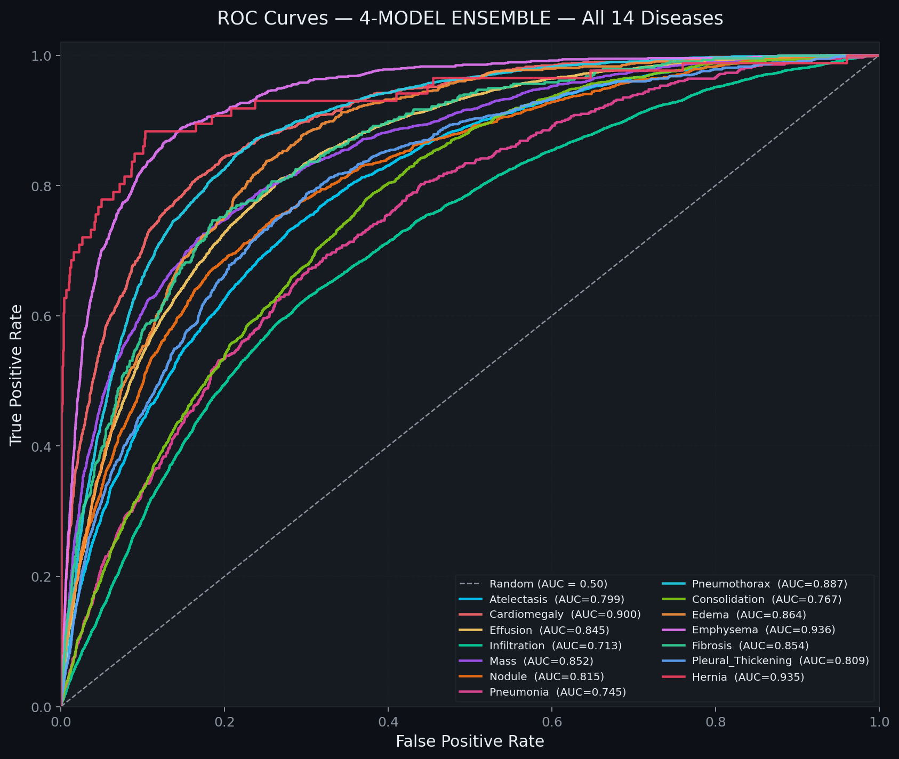
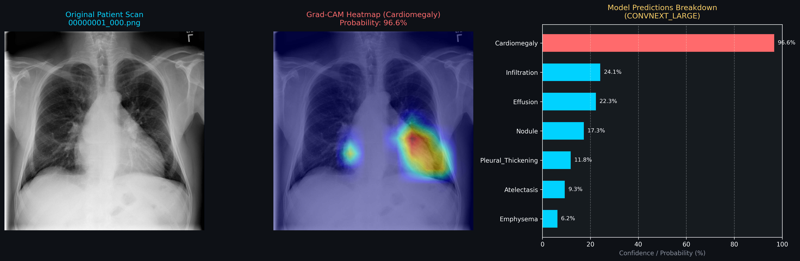
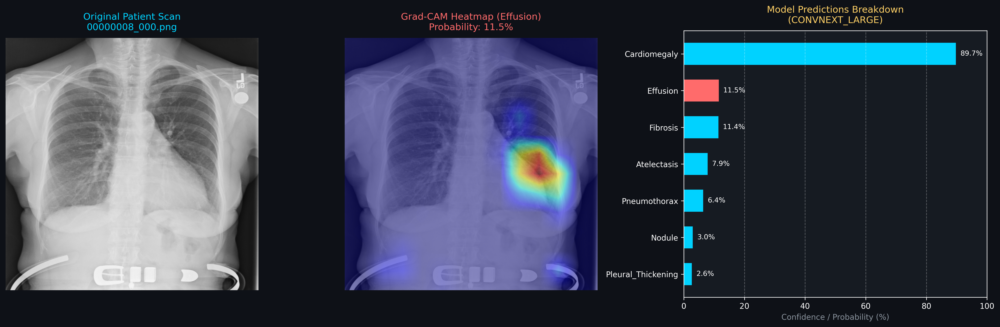

# SmartCXR

Educational PyTorch project for multi-label classification of 14 thoracic findings
on NIH ChestX-ray14, with single-model evaluation, weighted ensembles, and Grad-CAM.
For research and education only; predictions and heatmaps are not clinical diagnoses.

## Evaluation results

The saved reports provide **AUC-ROC, precision, recall, and F1**, rather than an
overall accuracy score. AUC measures how well predictions rank positive and negative
examples; it is not the percentage of correctly classified images. Values below
come from historical evaluations and have not been rerun during preparation.

| Model / experiment | Test images | Mean AUC-ROC | Micro precision | Micro recall | Micro F1 | Report |
|---|---:|---:|---:|---:|---:|---|
| Four-model ensemble + TTA | 25,596 | 0.8372 | 0.37 | 0.52 | 0.43 | [Details](info/ensemble-4model-test-output/evaluation_report_ensemble.txt) |
| Three-model ensemble + TTA | 25,596 | 0.8351 | 0.37 | 0.51 | 0.43 | [Details](info/ensemble-3model-test-output/evaluation_report_ensemble.txt) |
| ConvNeXt-Large | 25,596 | 0.8210 | 0.34 | 0.53 | 0.41 | [Details](info/convnext_large-test-output/evaluation_report.txt) |
| DenseNet-121 (historical checkpoint) | 25,596 | 0.8201 | 0.35 | 0.48 | 0.40 | [Details](info/densenet121-test-output/evaluation_report.txt) |
| CheXNet (12% test subset) | 3,072 | 0.8312 | 0.35 | 0.50 | 0.41 | [Details](info/CheXNet%20small-test-output/evaluation_report.txt) |
| DenseNet-121 (12% test subset) | 3,072 | 0.8244 | 0.35 | 0.48 | 0.40 | [Details](info/densenet121-test-output/evaluation_report_12pct.txt) |
| Swin-T (12% test subset) | 3,072 | 0.8197 | 0.33 | 0.54 | 0.41 | [Details](info/swin_t-test-output/evaluation_report_12pct.txt) |

Precision, recall, and F1 use a **0.5 threshold** and are rounded as in the saved
reports. Full-test and 12% subset results should be read separately. The full-test
DenseNet report records a different checkpoint path from the 12% report, so those
rows should not be interpreted as a direct comparison of the same model weights.

The four-model ensemble has the highest saved full-test mean AUC: **0.8372 (83.72%)**
on **25,596 images**. Historical validation scores and published test benchmarks use
different evaluation conditions; this repository makes no claim of outperforming
CheXNet or establishing a state-of-the-art result.

### Four-model ensemble: results by finding

| Finding | Test AUC-ROC |
|---|---:|
| Atelectasis | 0.7991 |
| Cardiomegaly | 0.8995 |
| Effusion | 0.8454 |
| Infiltration | 0.7127 |
| Mass | 0.8525 |
| Nodule | 0.8149 |
| Pneumonia | 0.7446 |
| Pneumothorax | 0.8870 |
| Consolidation | 0.7668 |
| Edema | 0.8644 |
| Emphysema | 0.9362 |
| Fibrosis | 0.8538 |
| Pleural Thickening | 0.8091 |
| Hernia | 0.9346 |

### ROC curves



## Project sample images

These saved ConvNeXt-Large examples show the original X-ray, the Grad-CAM overlay,
and model scores. The labels describe the heatmap target, rather than a confirmed
diagnosis. Scores shown inside the images are individual prediction probabilities,
not model accuracy. These examples are a visual demonstration, not an independent
test set or proof that the model focuses on the correct clinical features.

### Cardiomegaly target



### Effusion target



The Effusion example illustrates that a target heatmap can be generated even when
the model gives that finding a low score (11.5%). More saved samples and charts are
available in [the model output folder](info/convnext_large-test-output/).

## Setup

Use Python 3.11 or 3.12 in a virtual environment. Run all commands from the repository root.
Install a compatible PyTorch/torchvision pair appropriate for your CPU or CUDA environment,
then install the remaining dependencies:

```sh
python -m venv .venv
# Windows PowerShell: .\.venv\Scripts\Activate.ps1
# Linux/macOS: source .venv/bin/activate
python -m pip install -r requirements.txt
```

Dataset metadata and the supplied train/validation list are included. Download image
files separately from the [NIH dataset source](https://nihcc.app.box.com/v/ChestXray-NIHCC)
and flatten them into `images/`, retaining original filenames. Dataset materials and
derived examples remain subject to their original terms; the MIT license applies to
project code. Trained weights are not included; see [model setup](models/README.md).

The loader divides the supplied train/validation pool 80/20 by patient with seed 42;
the test pool is the metadata complement of the supplied list. It checks patient
overlap and fails on unreadable images. This release adds those checks without
regenerating historical results.

## Commands

Training with ImageNet initialization:

```sh
python src/train.py --model_name densenet121 --use_amp --damp_weights --augment_brightness_contrast --freeze_epochs 1 --run_name densenet121_best_accuracy_run
```

Single-model evaluation and inference, after supplying a trained checkpoint:

```sh
python src/test.py --model_name densenet121 --checkpoint_path checkpoints/densenet121_best_accuracy_run/best_model_auc.pth
python src/predict.py --image_path images/00000001_000.png --model_name densenet121 --checkpoint_path checkpoints/densenet121_best_accuracy_run/best_model_auc.pth
python src/test-4-model.py
```

Data locations can be overridden with `--csv_path`, `--img_dir`, and `--train_val_path`
in training and evaluation scripts. Use `--num_workers 0` when debugging data loading.
Visualization scripts are in `src/visualize-info/`; inspect their `--help` for options.
GPU memory requirements depend on architecture and batch size; reduce `--batch_size`
if necessary. Full training and inference require external images and weights.

## Contents

- `src/`: training, dataset, model, inference, evaluation, and visualization code.
- `info/`: historical evaluation reports, aggregate charts, and derived Grad-CAM examples.
- `models/README.md`: external weight setup.
- `Data_Entry_2017.csv`, `train_val_list.txt`: supplied dataset metadata and split list.

Legacy prose, the third-party paper PDF, office files, dashboard, and the one-off
book updater were omitted from this upload package. Existing report text is preserved
as historical evidence, including any old machine paths recorded there.
